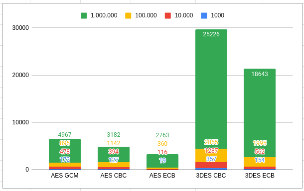
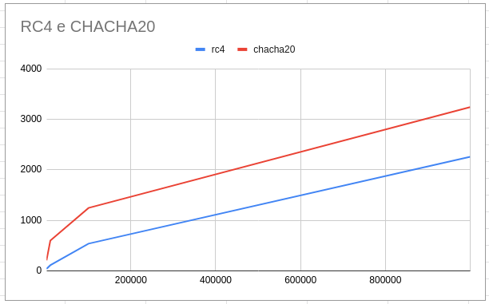

# Implementação de Algoritmos de Cifras Simétricas em Java
Está página contém exemplos de uso dos algoritmos de cifras simétricas de bloco e de fluxo.

 Para as cifras de bloco (src/main/java/blockCiphers), existem implementações para o AES existem nos modos ECB, GCM e CBC, para o 3DES foram implementados os modos ECB E CBC. Nas cifras de fluxo (src/main/java/streamCiphers), foram realizadas implementações para o Chacha20 e para o RC4.
 
 # Comparação de desempenho dos algoritmos de cifra de bloco
 Foi realizada uma comparação entre os algoritmos de cifra de bloco, para tal foram realizados experimentos contendo operações de cifrar e decifrar para conjuntos de 1000, 10.000, 100.000 e 1.000.000 de elementos. Cada elemento a ser criptografado/descriptografado é uma string de 9 caracteres, contendo 5 dígitos númericos separados pelo caracter ':', um exemplo seria:
 3:6:7:9:3
 
 Os numeros dos valores de entrada foram gerados de forma aleatória, nas comparações as mesmas entradas foram utilizadas. Foram realizadas operações de criptografar e descriptografar em todos esses elementos, a Figura 1 ilustra os resultados para cifra de bloco dos algoritmos AES e 3DES, é possível de observar que o tempo de execução do AES foi sempre menor, além disso, em ambos os algoritmos o modo ECB foi superior ao CBC.
 
 

  
  
Figura 1 - Tempo de execução cifras de bloco(milisegundos)

 
 
 # Comparação de desempenho dos algoritmos de cifra de fluxo
De mesma forma foi realizada a comparação entre os algoritmos de cifra de bloco, também foram realizados experimentos contendo operações de cifrar e decifrar para conjuntos de 1000, 10.000, 100.000 e 1.000.000 de elementos. Seguindo os mesmos padrões das entradas do anterior.
 
Novamente foram realizadas operações de criptografar e descriptografar em todos esses elementos, a Figura 2 ilustra os resultados para cifra de bloco dos algoritmos CHACHA20 e RC4, é possível de observar que o tempo de execução do AES foi sempre menor, além disso, em ambos os algoritmos o modo ECB foi superior ao CBC.
 
 

  
  
Figura 2 - Tempo de execução cifras de fluxo(milisegundos)

 
 

